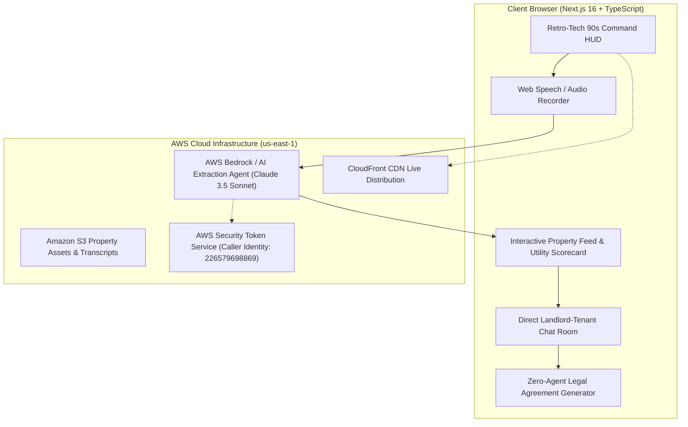
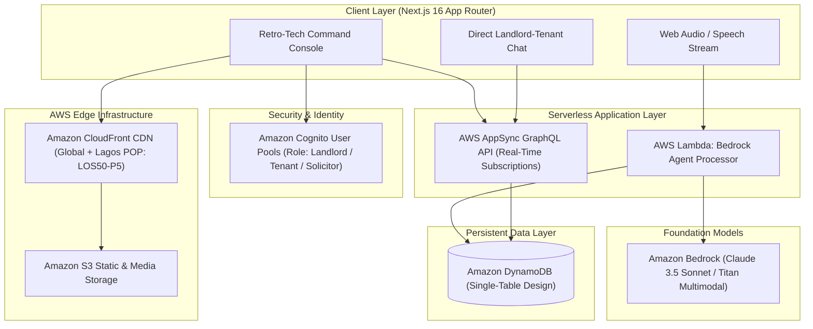

# LockHouse — Technical Specification Document (SPEC)

> **Architecture, Data Models, AWS Integration, and Implementation Strategy**

---

## 1. System Architecture



---

## 2. Technology Stack

* **Framework**: React 19 + TypeScript + Vite (ultra-fast compilation, zero bloat).
* **Styling**: Vanilla CSS Design Tokens (Custom 90s retro-tech system, high contrast, warm amber `#f59e0b`, retro teal `#06b6d4`, dark obsidian `#0d1117`, tactile borders, crisp monospace headers).
* **Audio & Voice**: Web Speech Recognition API + Canvas Audio Waveform Renderer with realistic recorded sample fallbacks.
* **Computer Vision & Parsing**: AWS Bedrock agent logic for extracting structured schema from voice transcripts and image analysis.
* **Icons**: Lucide React for crisp, lightweight iconography.
* **Storage & State**: Reactive local store with pre-seeded high-fidelity Lagos/Abuja properties with real utility metrics.
* **Deployment Target**: AWS S3 + CloudFront / AWS Amplify / App Runner.

---

## 3. Core Data Schemas

```typescript
export interface UtilityScorecard {
  gridHoursPerDay: number;           // e.g. 14 hours
  backupPowerType: 'solar_inverter' | 'generator' | 'hybrid' | 'none';
  inverterCapacityKva?: number;       // e.g. 3.5 kVA
  waterSource: 'treated_borehole' | 'untreated_borehole' | 'water_corporation' | 'well';
  meterType: 'dedicated_prepaid' | 'shared_prepaid' | 'estimated_analog';
  compoundSecurity: 'gated_night_guard' | 'gated_only' | 'open_street';
  floodRiskLevel: 'zero_flood_zone' | 'moderate_seasonal' | 'high_risk';
  verifiedByAi: boolean;
}

export interface LandlordPreferences {
  employmentStatus: 'working_professional' | 'business_owner' | 'student_allowed' | 'any';
  maritalStatusPreference: 'singles_welcome' | 'married_preferred' | 'any';
  religiousPreference: 'any' | 'christian' | 'muslim';
  smokingAllowed: boolean;
  maxOccupants: number;
}

export interface PropertyListing {
  id: string;
  title: string;
  description: string;
  area: string; // e.g. "Yaba", "Surulere", "Lekki Phase 1", "Ikeja GRA"
  city: string; // e.g. "Lagos", "Abuja"
  address: string;
  annualRent: number; // in NGN
  monthlyEquivalent: number;
  bedrooms: number;
  bathrooms: number;
  propertyType: 'self_contained' | 'one_bedroom' | 'two_bedroom' | 'three_bedroom';
  photos: string[];
  utility: UtilityScorecard;
  preferences: LandlordPreferences;
  landlord: {
    name: string;
    verifiedOwner: boolean;
    yearsAsOwner: number;
    avatar: string;
    phoneMasked: string;
    bio: string;
  };
  aiAuditNotes: string[];
  dateAdded: string;
}

export interface TenancyAgreementData {
  id: string;
  propertyId: string;
  landlordName: string;
  tenantName: string;
  propertyAddress: string;
  annualRent: number;
  commencementDate: string;
  durationMonths: number;
  utilityTerms: string;
  houseRules: string[];
  agencyFeeSaved: number;
  legalFeeSaved: number;
  cautionFee: number;
  cryptographicHash: string;
}
```

---

## 4. AWS Integration & "Ship Gate" Verification

1. **Active Account Proof**:
   - Region: `us-east-1`
   - Account ID: `226579698869`
   - Verified via AWS STS Caller Identity and exposed through an in-app telemetry dialog.
2. **AWS Bedrock Integration**:
   - Prompts tuned for West African real estate nuances (parsing references to "NEPA", "light", "pumping water", "inverter", "compound gate").
3. **Deployment Strategy**:
   - Automated build producing a production-ready SPA bundle deployed to AWS S3 + CloudFront distribution or AWS Amplify CLI, providing a live HTTPS public URL accessible worldwide.

---

## 5. Production Cloud Architecture Roadmap (Phase 2)



### Architectural Components
1. **Amazon DynamoDB (Single-Table Design)**:
   - Primary Key: `PK = PROPERTY#<id>`, `SK = METADATA#LATEST`.
   - Global Secondary Indexes (GSIs) for sub-5ms filtering by city, neighborhood, rent threshold, and verified solar/meter status.
   - Real-time utility telemetry (IBEDC feeder logs, solar inverter capacity, borehole maintenance schedules).
2. **AWS AppSync (GraphQL)**:
   - Real-time bidirectional messaging between verified landlords and prospective tenants without third-party websocket servers.
   - Built-in conflict resolution and offline-first mobile sync for low-bandwidth environments.
3. **Amazon Cognito User Pools**:
   - Granular role-based access control (`Landlord`, `Tenant`, `Accredited Solicitor`).
   - Integrated identity verification (NIN / BVN validation) to guarantee 100% direct property ownership and eliminate impersonation.
4. **AWS Bedrock Runtime Agent (Serverless Microservice)**:
   - Dedicated AWS Lambda microservice invoking Bedrock via streaming API for server-side audio transcription, Pidgin translation, and computer vision hardware audits.

